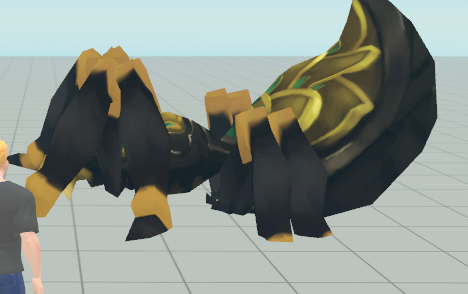
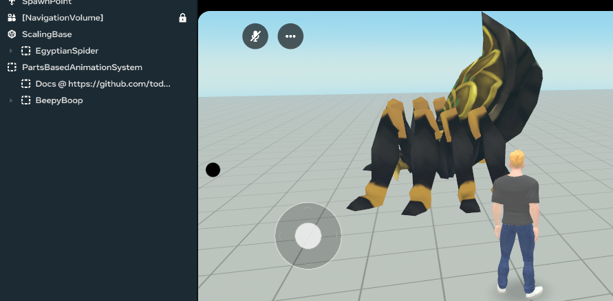

# Horizon Worlds Parts-Based Animation (HWPBA)

Lightweight tools + workflow for building parts-based animated characters in Horizon Worlds. Export from Blender → upload FBXs + a single Text Asset → drive animations in HW with a small script.

## Watch the tutorials

Two short series walk through the pipeline end-to-end:

1) Robot — intro to parts-based animation, auto-rigging, animation, importing assets, and playing an animation. [Playlist](https://www.youtube.com/watch?v=ZMkUVivK_g8&list=PLUvQxgmNxn_K_ldPvYo_6NdrK7b33ZSCp)

2) Egyptian Spider — breaking up a more complex, soft-bodied creature into parts, and a more interesting animation. Playlist: COMING SOON

Follow along using the starter files below.

## Download to follow along

- [Robot starter .blend](https://raw.githubusercontent.com/todd-roberts/HWPBA/main/blendFiles/BeepyBoop.zip)  

- [Blender extension (zip)](https://raw.githubusercontent.com/todd-roberts/HWPBA/main/hwpbaExtension.zip) — You can just drag this into Blender to install.  
  
## Scripting

Search the Horizon Worlds public assets for `PartsBasedAnimationSystem` to add the core script to your world. The tutorials above demonstrate how to script against the system.

### Using the public asset
After adding the `PartsBasedAnimationSystem` asset to your world, you'll have the required scripts to implement the system. At this point, feel free to delete the entire entity that was created when you dragged the asset into the world. You may also delete the BeepyBoop and EgyptianSpider scripts. Depending on your use case, you may wish to hold on to the `ScalingBase` entity which is a parent of the `EgyptianSpider` entity. See the "Scaling issue / fix" section below for more information.

## Scaling issue / fix

Parts-based characters do not scale in the Y axis by default. You can see this within Blender or your worlds. This is because parts need independent origins (pivot points) and as such scaling in the Y axis will cause them to drift apart as they scale at different rates.

<figure>
  
  <figcaption>The spood's abdomen is disconnected and goes through the ground</figcaption>
</figure>

There are two simple solutions:

1. Design your character purposefully in Blender at the scale you want it to be for your world, such that you won't ever need to scale it. If you are starting with a character that is not separated, this requires scaling *before* breaking it up into parts and setting their respective origins. This is the preferred option, however, it prevents the possibility of re-using the parts/animations for different-sized or themed characters, which can be incredibly powerful and time-saving.

2. Use the ScalingBase entity that will be included in the public `PartsBasedAnimationSystem` asset. This is a special wrapper you can place your character within that will allow you to scale the character up or down as much as you want while keeping it on the ground plane.

<figure>
  
  <figcaption>Fixed!</figcaption>
</figure>

Note that, if you need to programmatically scale your character at runtime, your scripts will need to modify the scale of the ScalingBase entity and not the character itself.

## PreStart
Note that the base class, `PB_AnimatedComponent`, leverages `preStart()` to initialize. If you need to hook into preStart in your child class, do one of the following:

1. Call `super.preStart()` at the start of your preStart override.
2. Use `onPreStart()` instead, which is called within the base class preStart.

## Simplified/primitive colliders

If you want to add primitive colliders to your parts, I highly suggest the following workflow:
1. Create a new empty object from the `Build` menu in the desktop editor. 
2. Re-name the new object to have the exact name of your part, e.g. if your part is named "Giant_Arm.L" your new object should be named exactly "Giant_Arm.L". This is because the animator looks for objects with these specific names.
3. Make the new object a child of your original part, zero out its transform so that the origins match, and then drag it outside of the part so that they are siblings. 
4. Drag your part inside the new object so that it's a child of the new object.
5. Turn off your part's collidability, but keep it visible.
6. Add whatever primitive colliders you want as children of the new object (they will be siblings of the part)

## Limitations
- The system is designed for parts-based animation, not vertex-based animation. 
- Currently, scaling within the animations themselves is not suppported. That will be added in v2.
- File-backed Scripts are required to bring in scripted public assets. If you cannot or don't want to enable File-backed Scripts in your world, you can download [the typescript file](https://raw.githubusercontent.com/todd-roberts/HWPBA/main/PartsBasedAnimationSystem.ts) and put it in your world's scripts directory. 

## Having trouble?

Open an issue on this repo with:
- Blender version + OS
- Steps to reproduce
- (Optional) a small .blend or screenshots

---

License and contributions: PRs welcome. Use at your own risk.
